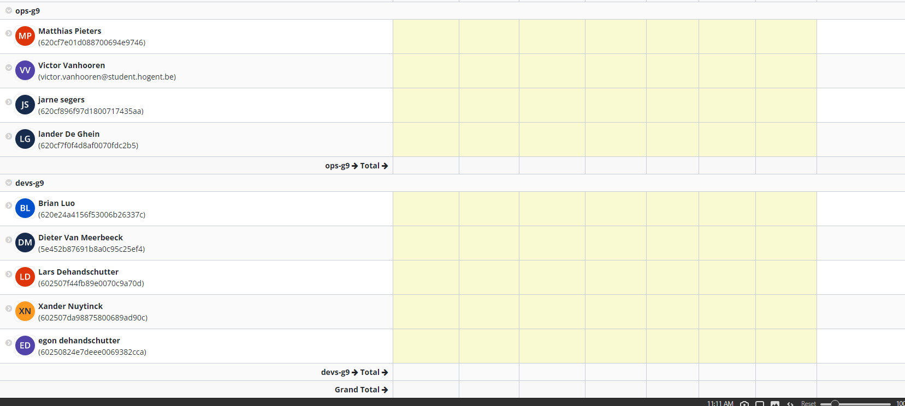

# Logboek Week 1:

## Screen Jira

# Victor

## Gerealiseerd

- kickoff vergadering bijgewoond
- groepjes samengesteld
- instructies doorgelezen
-

## To do

- afspraken maken met devgroep
- communicatie leggen met devgroep
- vakliteratuur doornemen
-
-

# Lander

## Gerealiseerd

- kickoff vergadering bijgewoond
- groepjes samengesteld
- instructies doorgelezen

## To do

- afspraken maken met devgroep
- communicatie leggen met devgroep
- vakliteratuur doornemen

# Jarne

## Gerealiseerd

- kickoff vergadering bijgewoond
- groepjes samengesteld
- instructies doorgelezen

## To do

- afspraken maken met devgroep
- communicatie leggen met devgroep
- vakliteratuur doornemen

# Matthias

## Gerealiseerd

- kickoff vergadering bijgewoond
- groepjes samengesteld
- instructies doorgelezen

## To do

- afspraken maken met devgroep
- communicatie leggen met devgroep
- vakliteratuur doornemen