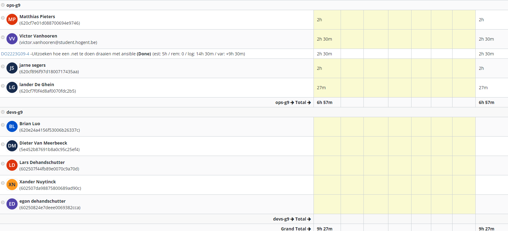

# Logboek Week 2:

## Screen Jira

# Victor

## Gerealiseerd

- opzoek werk in verband met het maken van een docker container voor ASP.NET webapp

## To do

- opzoekwerk in verband met Jenkins, Ansible en ASP.NET

# Lander

## Gerealiseerd

- cloud shortlist
- jira deeltje
- helpen bij .net
- github repos in orde gebracht

## To do

- user story map
- locale omgeving opzetten

# Jarne

## Gerealiseerd

- Jira enviroment opzetten
- opzoekwerk naar cloud providers

## To do

- opzoekwerk in verband met Jenkins, Ansible en ASP.NET

# Matthias

## Gerealiseerd

- opzoekwerk hoe ASP.NET applicatie runnen met docker

## To do

- ASP.NET verder opzoeken
- opzoekwerk ivm jenkins, ansible
