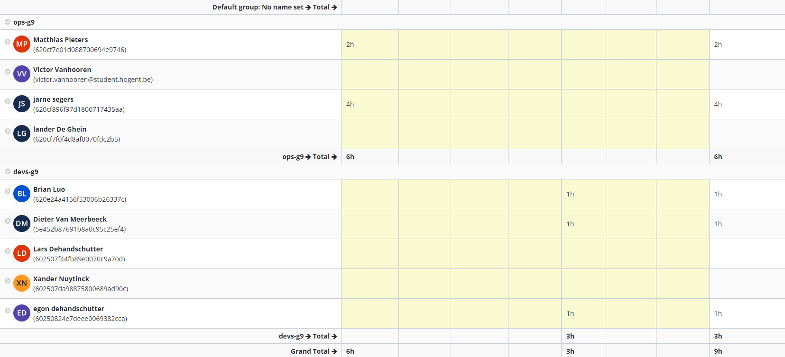

# Logboek Week 3:

## Screen Jira

# Victor

## Gerealiseerd

- uitvoeren van een docker container in een virtuele machine en proberen te automatiseren
- uitzoeken hoe dockerfiles en dockercompose werken
-
-

## To do

- architectuur plan opstellen omgeving
- opstellen user story maps
-

# Lander

## Gerealiseerd

- aanpassingen cloud shortlist
- helpen bij .net + overleggen met lectors
-

## To do

- architectuur plan
- user story map maken
- overelggen met devs

# Jarne

## Gerealiseerd

- uitvoeren van een docker container in een virtuele machine en proberen te automatiseren
- uitzoeken hoe dockerfiles en dockercompose werken

## To do

- architectuur plan opstellen omgeving
- opstellen user story maps
- starten met het local test environment

# Matthias

## Gerealiseerd

- verder uitzoeken en oplossen van problemen bij het gebruiken van docker containers om .NET applicaties te runnen.

## To do

- opstellen user story maps
- uitzoeken hoe we servers met ansible opzetten in AWS
