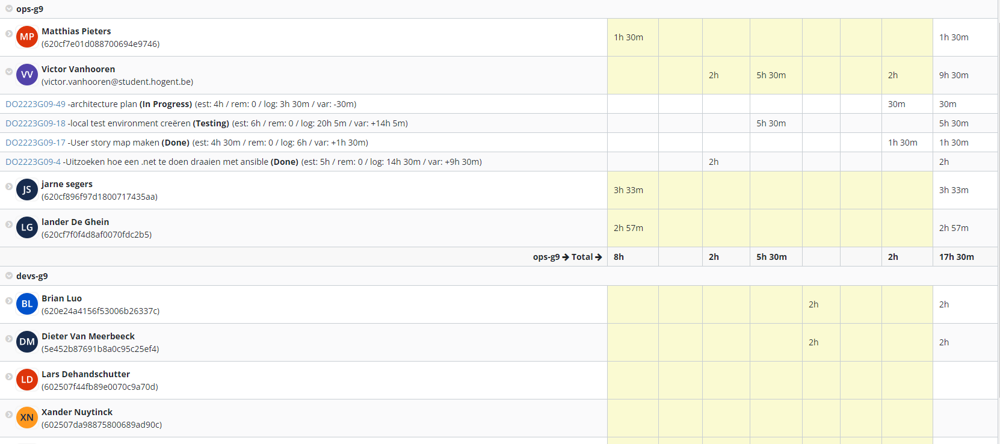

# Logboek Week 4:

## Screen Jira

# Victor
## Gerealiseerd

- Beginnen met opbouwen van locale testomgeving
- Uitzoeken hoe alles geautomatiseerd kan worden via ansible
-
-

## To do

- Uitzoeken hoe alles samen kan werken met Jenkins
- Architectuur plan opstellen

# Jarne

## Gerealiseerd

- deel van de locale test environment opgesteld
- 1ste draft user story map gemaakt

## To do

- starten met het opzetten van de build server

# Lander

## Gerealiseerd

- User map story afwerken
- Architectuur plan grotendeels in orde

## To do

- architectuur plan afwerken
- kijken voor AD server

# Matthias

## Gerealiseerd

- user story map afwerken
- Nog een paar problemen afwerken van docker met .NET

## To do

- opzoeken hoe integreren van servers in Cloud omgeving
